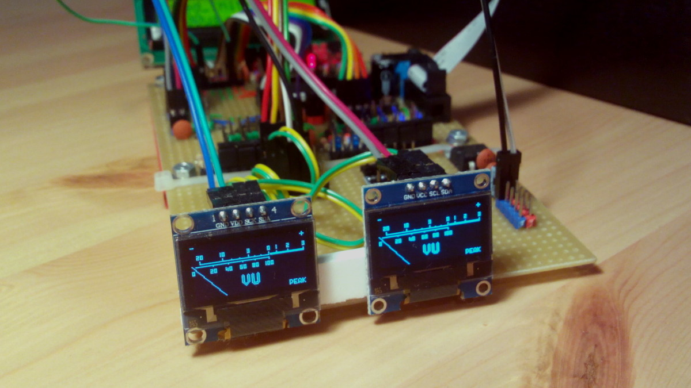

# Journal

No records before this date survived.

## 23th November 2017

Got the project to a working state: both displays are showing the same animation of a needle in low FPS (~10). 
Peak indicator is flashing when needle goes far enough to the right.

FPS is currently so low because of several reasons:
- whole screen is re-rendered each time,
- rendering is async, but rendering and sending doesn't actually overlap.

For now I'll focus on the second issue. The plan is to modify I2C driver to use double buffering.

Possible next steps:
- write all operations to the buffer (sending start/stop conditions, sending address), so reading buffer 
can be decoupled from tasks logic,
- provide better format for the buffer, that is both efficient and concise.

## 26th November 2017

FPS is back to normal with double buffering. At the same time clock cycles saved through asynchronous
operation amount to between 5% and 20% of display redraw. Taking into account all overhead, both
in program memory and RAM, plus all the complexity, it doesn't seem worth the time invested. If it proves
to be impossible to free at least 50% of clock cycles I'll switch to synchronous I2C instead.

## 30th November 2017

After a few days fighting bugs in I2C driver it finally works.

Currently full screen update takes about 26.5ms which is 3.2ms longer than theoretical 
minimum of ~23.3ms. From this about 2.85ms can be attributed to delay caused by interrupt
prologue and command processing: there is 4 clock cycles delay to jump into ISR, then
pushing all the registers takes additional 34 cycles, and dispatching the command another 17.
That's 55 clock cycles in total for each of 1037 dispatched commands, which divided by 20MHz clock
frequency gives ~2.85ms. Some additional delay at the beginning is caused by double
buffering: when first buffer is filled nothing can be transmitted yet.
